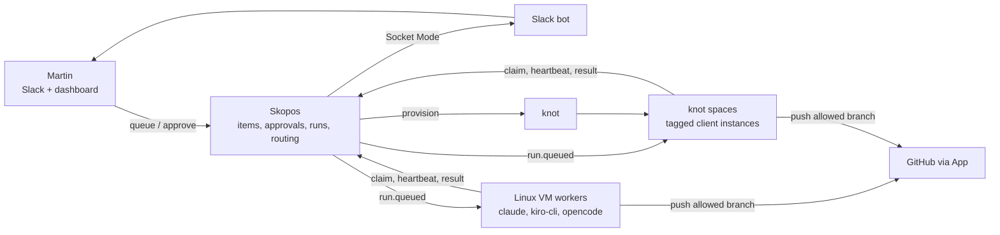
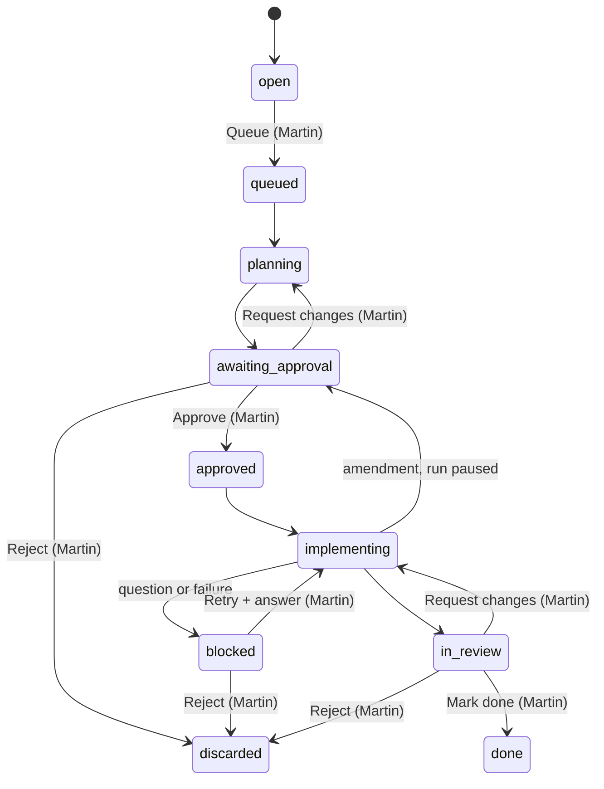

# Skopos agent pipeline — design

Oct 1, 2026 · @Martin Suchenak

> **Frozen 2026-10-01**, on branch `agent-pipeline-1a`, as the source of truth for the build (Phase 1a first). The five review rounds live in `agent-pipeline-review.md`. Changes after the freeze go through a new decision-log entry and a dated revision of this document.

## Summary

The goal is parallel agent work across several machines, agents and projects: Skopos inbox items become implemented, verified feature branches, with Martin approving each plan before any code is written and reviewing the result before it's merged. Agent output quality on freedom3 is already proven, so the design is about orchestration, safety and verification. This document is the single source of truth, consolidated on 2026-09-30; history lives in the decision log at the end.

- **Track A: trial (running).** `agent-trial`, a small Go tool on this Mac. It turns Skopos items into plans with Claude, takes approvals from Slack, implements in worktrees, and pushes branches and opens PRs on the local Gitea only.
- **Track B: full build.** Skopos becomes the control plane: item workflow, approvals tied to a plan revision and base commit, a run queue, tag-based routing, workspace groups for keys, and Slack. Phantom workers on always-on Linux VMs and knot spaces become the execution plane, running any CLI agent (claude, kiro-cli, opencode).

Agents only ever push to their workspace's allowed branch pattern, never to `PROD`, `main`, `master` or other protected branches, and never merge. In the trial, agents never touch GitHub. In Track B, they push allowed branches and draft PRs to GitHub through a restricted GitHub App, which is a hard prerequisite for any GitHub push.

## Requirements and hard rules

| # | Requirement | Where it's enforced |
| --- | --- | --- |
| R1 | Martin chooses which items agents work on | Trial: the `ready` tag or `new:` in Slack. Track B: the `inbox_queue` action |
| R2 | Agents research and write a plan in Skopos, then notify Martin | Planner run and a Slack message |
| R3 | No code is written until Martin approves that exact plan revision, including its base commit | Approval tied to a plan revision and its `base_sha`; the revision is locked |
| R4 | If the plan must change mid-run, the run **pauses** until the amendment is approved | Amendment creates a new revision and goes back to `awaiting_approval` |
| R5 | Work happens on a new branch in the repo given by the item's `workspace_id`, in a dedicated agent clone or space, never Martin's working checkout | Worker plus a workspace-to-repo map, or a knot space |
| R6 | Pushes go only to the workspace's allowed branch pattern (`agent/*`, or freedom3's `WR{n}-{slug}`), never to `PROD`, `main`, `master`, `develop`, `release/*` or `hotfix/*` | Server side (layer 0) is the only real enforcement; worker validation and client guards catch mistakes earlier |
| R7 | **Trial:** agents never touch GitHub; branches and PRs go to the local Gitea only. **Track B:** agents push allowed branches and open draft PRs on GitHub (for Copilot review) and never merge | Trial: Gitea only, no GitHub credentials anywhere. Track B: GitHub App plus org ruleset, required before any GitHub push |
| R8 | Everything runs on the local network; Skopos can't be reached from the internet | Slack Socket Mode (outbound only) |
| R9 | Any repo, several machines and agents | Runner templates, tag-based routing, pull-based workers |
| R10 | An approval-policy hook exists from day one; every gate is required at first | `approval_policy` per workspace |
| R11 | When an agent's allowance runs out, work pauses and resumes after the reset with nothing lost | Quota detection, pausing that runner, session resume |
| R12 | Agents can use MCP tools (a must). Each deployment has its own MCP config, with full Skopos access. A per-deployment deny list blocks, by default, Fortix production writes (llmrouter `create_work_request`, `reply_to_work_request`, `create_client_from_email`, `request_file_upload`) and the llmrouter scriptling stores (`set_prompt`, `set_skill`, `qdrant_upsert`) | `--mcp-config <file> --strict-mcp-config` plus deny rules. Workflow integrity comes from the server-side `approver` permission, which agent keys never get. Trial exception: until `agent-trial` uses the 1a APIs, it also denies Skopos `execute_tool`, because its workflow state is plain tags |

**Out of scope:** merging, auto-deploys, and agents acting on items nobody queued.

## Track A: the trial (as built)

`agent-trial` lives in `~/Development/personal/agent-trial`. launchd runs it every minute through a small launcher that holds macOS's Local Network permission. Each tick handles Slack and finishes items marked done in a few seconds. Plans and implementations run in a separate background worker (`agent-trial work`), so replies are picked up even during long runs. It covers freedom3 only, in a separate clone (`~/Development/tmp/freedom3`) whose only remote is the local Gitea. Skopos and phantom are unchanged, and the Cowork quick-note job keeps running.

### State (tags on the inbox item)

```mermaid
stateDiagram-v2
    [*] --> ready: Martin tags or sends new:
    ready --> agent_planning: claim
    agent_planning --> plan_review: plan written
    plan_review --> approved: approve
    plan_review --> agent_planning: revise + notes
    plan_review --> discarded: reject
    approved --> agent_implementing
    agent_implementing --> plan_review: amendment (paused)
    agent_implementing --> branch_ready: PR opened
    agent_implementing --> agent_blocked: failure or question
    agent_blocked --> agent_implementing: retry + answer
    branch_ready --> agent_implementing: changes + notes
    branch_ready --> [*]: done
```

The item stays claimed (`in_progress`) until Martin marks it `done`, so its tags stay editable throughout. `inbox_convert` runs only at `done`, because a converted item can't be changed. Completing the final "Review and push (Martin)" step then completes the plan and the item.

Martin's `revise:` and `changes:` replies first set an intermediate tag (`revise`, `changes-requested`), which the worker picks up on its next pass. The diagram folds these into the arrows labelled "revise + notes" and "changes + notes".

### How it works

- **Slack is the interface.** Each item has one Slack thread. A `new: <what to do>` DM creates the item, with that message as its thread root; otherwise the first bot message starts the thread. Replies accepted only from Martin's user id: `approve`, `approve: <answers>`, `revise: <notes>`, `changes: <notes>`, `done`, `retry: <answer>`, `reject`, `help`. Messages are short (summary, step titles, numbered questions, one-line review verdict) and capped below Slack's split limit; full detail lives in Skopos and the PR. A reply about an item that's mid-run is applied once the run finishes.
- **Planning** runs `claude -p` in the agent clone, returns a structured plan (title, summary, size, steps, risks, questions), writes it to Skopos as a plan with one item per step plus a final review step, and appends an Enrichment section to the inbox item.
- **Implementation** creates a worktree on `agent/<item>-<slug>` from `origin/PROD` with no upstream. Each worktree gets its own `vendor` as an APFS copy-on-write clone (a symlink breaks PHPStan). The agent commits one step at a time. It stops with an amendment if the plan is wrong, or stops blocked with one direct question. `retry: <answer>` resumes the same session.
- **Finishing:** the tool runs `php -l` and PHPStan on the changed files and a Claude review pass. It then pushes (see push transport below), opens or updates the Gitea PR, and posts the result to the item's thread.
- **Agent sandbox:** `--permission-mode dontAsk` with an explicit tool allowlist, the MCP deny list from R12, deny rules for push, remote, config and branch commands, no credentials in the environment, and `caffeinate -i` while a run is active.
- **Robustness:** a tick lock and a worker lock, orphan recovery after a crash, a transient-error retry limit, full item content fetched for every item (Skopos list calls return only excerpts), a JSON log of every action, and every Claude run's output saved.

### Push transport

The tool fetches over SSH with Martin's key. It pushes over **HTTPS with the `agent-bot` token**, passed through git's environment so it never appears in command arguments. The agent process never has SSH access or tokens. Its environment has no SSH agent, and SSH git is disabled with `GIT_SSH_COMMAND=/usr/bin/false`.

### When an allowance runs out

The tool detects usage-limit errors, pauses all Claude runs until the reset (or a 30-minute back-off that doubles up to 2 hours), tags the item `agent-waiting-quota` and sends one Slack message. After the reset it resumes the same session (`claude --resume`), or continues from the committed steps if that session can't be resumed.

### What to measure

| Metric | Keep going if |
| --- | --- |
| Plans approved without changes | About half or more |
| Branches Martin would push as-is, or after one `changes:` round | About half or more |
| Martin's review time per item vs doing it himself | Clearly lower |
| Runs that fail, time out or block (sleep interruptions excluded) | About a quarter or fewer |
| Guardrail incidents (push outside the pattern, edits outside the worktree) | Zero |

With 10–15 items, one item is 7–8 points, so these are directional only. `PROD` on Gitea is frozen at `d2ce73dfdd1`, so keep trial items small. Measured so far: about $1.50 of usage per small item.

## Track B: architecture

Skopos holds all state and decisions; workers do all the execution. They talk only through Skopos's API and SSE event stream, so a worker can run anywhere that reaches Skopos on the local network.



Only Martin's actions open a gate. Workers never talk to Slack, and agents never hold git credentials.

### End-to-end flow

1. Martin queues an item from the dashboard, Slack (`new:`) or a quick-note shortcut, optionally with tags such as `#claims`.
2. Skopos queues a `plan` run, which always goes to Claude.
3. A worker runs the planner, which returns steps, size, suggested required tags and risks. The worker stores them as plan revision 1, recording the `base_sha` the planner read.
4. The item moves to `awaiting_approval`. The Slack message includes a routing preview: required tags, the worker kind and runner, the matching rule, and the WR number.
5. Martin approves (`approve`, `approve: <answers>`, or with overrides such as `tags=insurance runner=kiro-cli wr=108900`). The approval is recorded against that revision and base commit, and the revision is locked.
6. Routing queues an `implement` run. A matching worker takes it, or knot creates a space from a matching template. The branch starts from the revision's `base_sha` and is named from the workspace's branch template.
7. The pipeline runs: checks, tests, Copilot review, up to 2 automatic fix rounds, then `sync-base` if the base has moved in a conflicting way.
8. The item moves to `in_review`. Martin reviews the branch, and the review approval is tied to its head commit. He merges and marks the item done; the worker cleans up.

## Skopos changes

The inbox item holds the workflow state. Every approval is recorded against something that can't change: a plan revision plus its base commit, or a branch head commit. It's the same idea as Terraform's plan-then-apply and GitHub's stale-review dismissal. The existing statuses, claim and convert stay for manual work.

### 1. Item workflow statuses



- Any agent phase can go to `blocked` or `failed` with a reason. Both return to their phase with Retry (with an answer) or go to `discarded` with Reject; the diagram shows `blocked`, and `failed` has the same edges. Reject also works from `in_review`, and it closes the PR and deletes the branch.
- **Human-only actions:** `inbox_queue`, `inbox_approve`, `inbox_request_changes(notes)`, `inbox_reject`, `inbox_mark_done`. They require the `approver` permission.
- **System transitions** (`planning`, `implementing`, `in_review`, `failed`, `blocked`) happen only as a side effect of runs.
- **The item timeline is a view of the audit log.** Every transition is recorded by the audit log from the existing plan "Persisted audit log for mutations" (`01a0bf7c`): actor, via (dashboard, Slack or worker), action, subject, notes and time. There's no separate `item_events` table. Change-request notes are passed into the next run's prompt.

**Moving the trial over (1a).** When `agent-trial` switches from tags to these statuses, in-flight items are migrated once, by this table:

| Trial tag | Status | Notes |
| --- | --- | --- |
| `ready` | `queued` |  |
| `agent-planning` | `planning` | The run restarts |
| `plan-review` | `awaiting_approval` | A plan revision is created from the current plan, with the trial's frozen base as `base_sha` |
| `revise` | `planning` | Review notes carried over |
| `approved` | `approved` | The approval is recorded as `via: migration` |
| `agent-implementing` | `implementing` | Resumes with `resume_kind: session` |
| `branch-ready` | `in_review` |  |
| `changes-requested` | `implementing` | Change notes carried over |
| `agent-blocked` | `blocked` | Reason carried over |
| `done` | `done` |  |
| `agent-waiting-quota` | (unchanged phase) | Becomes a run paused with `reason: quota` |
| (discarded item) | discarded | Rejected trial items keep their status; only the audit history is backfilled |

### 2. Approver permission and threat model

- `approver` is a new per-action permission on top of today's root and scoped keys. Agent and worker keys never get it.
- **Slack principal:** the Slack module (phase 2) acts as Martin after checking his Slack user id. The gate therefore rests on Martin's Slack account not being compromised. Blast radius if it is:
  - branches matching the allowed patterns and draft PRs, never protected branches (server rules still apply)
  - WR creation through the Fortix MCP (`create-wr`), the only write to a production system outside git hosting
  - usage spent on approved runs

  Every approval is audit-logged with `via: slack`, and `create-wr` can be limited to the dashboard if needed.
- **Interim approver key (1a only):** while `agent-trial` still relays Slack approvals, it holds a dedicated key with `approver`. That key is Martin-equivalent, used only by the Slack command handler, never passed to an agent session, and revoked when the Slack module lands in phase 2. It's the one documented exception to "agent and worker keys never get approver".

### 3. Workspace groups for API keys

Keys get workspace groups such as `work` and `personal`, so adding a workspace to a group gives every key in that group access immediately.

```sql
workspace_groups          (id, name UNIQUE, description, created_at)
workspace_group_members   (group_id, workspace_id)   -- explicit members
workspace_group_patterns  (group_id, pattern)        -- optional auto-membership, e.g. github.com/fortix/*
api_key_groups            (api_key_id, group_id)
```

- **Resolved inside `LookupKey`:** a key's scope is its explicit workspaces, plus its groups' members, plus registered workspaces matching its groups' patterns. `Principal` and every `CanAccess` check stay unchanged. `Authenticate` already does a fresh lookup on every request, so changes apply on the next request. Newly registered workspaces that match a pattern are picked up straight away. Workspace ids that were never registered aren't covered; they have no data.
- **Patterns** follow Go `path.Match`: `*` matches one path segment and never crosses `/`. There's no `**`.
- **`*` (all workspaces) keeps its current meaning,** including root-only visibility of unfiled captures. Groups are flat, and a key can have several.
- **Stream drops are wired explicitly.** These events call `DropKey` for the affected keys, which then reconnect with the new scope:
  - a group's members or patterns change: every key holding that group
  - a key's groups or workspaces change: that key
  - a workspace is registered that matches a group pattern: every key holding that group
- **Root-only management** through the API, CLI (`skopos group create`, `skopos group add`, `skopos key create --group`) and dashboard. Changes are audit-logged. Two views: `whoami` (what a key can reach, and through which groups) and `skopos key who-can <workspace>` (which keys can reach a workspace, and how).

### 4. Plan revisions, base commit and approvals

- `plan_revisions`: an immutable snapshot of a plan's steps, a content hash and the `base_sha` the planner read. Plans created in interactive sessions keep working unchanged, with no revisions and no gate.
- An approved revision is **locked**. A running agent can change step status but can't add, remove or rewrite steps. A deviation becomes an amendment: a new revision that pauses the run.
- `approvals`: `{item_id, gate: plan|review, subject: plan_rev_id+base_sha | head_sha, decision, actor, via, notes, at}`. A new commit after a review approval makes that review stale.
- **An old base triggers a warning:** if the base is older than 3 days (configurable) when Martin approves, the message warns and suggests `revise` to re-plan on a fresh base.

### 5. Runs and leases

```
run = {id, item_id, plan_rev_id, stage, runner, worker_id, required_tags[],
       status: queued|claimed|running|paused|succeeded|failed|interrupted|cancelled,
       resume_kind: session|branch, lease_expires_at, attempt,
       branch, base_sha, head_sha, result_summary, diffstat, checks[], log_ref}
```

- `run_claim(worker_id)` claims atomically. It matches the run's workspace, runner preference and required tags against what the worker registered, and only returns a run while the worker has spare `capacity` (active runs below its registered capacity).
- Workers send heartbeats to extend their lease. When a lease expires, the run is re-queued and resumes with `resume_kind: branch` (fresh context from the last pushed commit). A pause for quota or an amendment resumes with `resume_kind: session` (the same agent session on the same worker). Metrics report the two separately.
- A lease lost while a machine sleeps counts as `interrupted`, not `failed`, and is left out of failure metrics.
- **Quota:** when a runner hits its allowance, that runner is marked unavailable on that worker until the reset, and routing falls back to the next runner in the rule.
- **Run events:** workers forward the agent's event stream (for Claude, `stream-json`) to Skopos as the run happens, stored with the run (1b). The dashboard transcript view is built on this.

### 6. Routing

- **Tags, not config parsing.** Martin tags knot templates, instances and nodes, for example `freedom3-futeng` → `generic-quoting`, `freedom3-lgm` → `claims`, `freedom3-gsa` → `insurance`. An item's required tags come from Martin's note (`#claims`) or from the planner, which picks from the registered tags. A worker takes a run only if it has every required tag.
- **Rules per workspace and stage, first match wins:**

```yaml
github.com/fortix/freedom3:
  approval_policy: {plan_gate: required, review_gate: required}   # later: auto_if_small
  rules:
    - when: {tags: [claims]}
      implement: {runner: [claude, kiro-cli], worker_tags: [claims]}
      tests:     {worker_tags: [claims]}
    - when: {size: s}
      implement: {runner: [opencode-local, claude]}
    - default:
      plan:      {runner: [claude]}
      implement: {runner: [claude, kiro-cli]}
github.com/martinsuchenak/skopos:
  rules:
    - default:
      implement: {runner: [opencode-glm, claude]}
```

- A list of runners is an order of preference: when the first can't run, the next one does. An explicit override from Martin wins.
- **The routing preview is always shown at approval,** including required tags, so a wrong pick by the planner is visible at the gate.

### 7. Branch templates and WR numbers

- Branch and commit templates are set per workspace. freedom3 uses `WR{n}-{slug}`, with commits starting `[#{n}]`. Other workspaces use `agent/{id}-{slug}`.
- **No WR, no implementation (freedom3):** the plan message asks for a WR number. Martin replies `approve: wr=108900`, or `approve: create-wr` to have the tool create the WR through the Fortix MCP and use its number.
- The worker's push check and the GitHub ruleset are both generated from the same template, for example `^refs/heads/WR\d+-[a-z0-9-]+$`.

### 8. Events

`events.Event` gains `entity` and `id` fields. Workers subscribe to `run.queued` over the existing SSE stream, with a 60-second polling fallback.

### 9. Slack module (phase 2)

- **Socket Mode:** Skopos opens an outbound WebSocket to Slack, so no public URL is needed.
- **One thread per item,** with the trial's short message formats. Each message has buttons, and the equivalent text replies keep working:

| When | Content | Actions |
| --- | --- | --- |
| `awaiting_approval` | Summary, step titles, risks, numbered questions, routing preview, WR | Approve (optional notes form for answers) · Request changes · Reject |
| Amendment proposed | Why, plus the changed remaining steps | Approve · Request changes · Reject |
| `in_review` | Branch and PR link, diff stats, checks, review verdict, how far behind the base | Mark done · Request changes · Reject |
| `blocked` or `failed` | Reason and the one question to answer | Retry (with an answer form) · Reject |
| Quota pause | Which runner, and until when | None |

- **`new:` with several workspaces:** `new <alias>: <what to do>`, where each workspace has a short alias (for example `ff3`, `skopos`). Plain `new:` uses the Slack user's default workspace. If it's ambiguous, the bot asks in the thread and offers the options.
- **Every action is checked against Martin's user id** and recorded with `via: slack`. Messages carry the essentials, because dashboard links only open on the home network.

### 10. Dashboard

The item view gets:

- the approval actions
- the audit timeline
- a diff between plan revisions
- the routing preview
- run results

There's also a workers page (registered workers, their tags, runners, capacity and last heartbeat) and a groups page.

**Watching and taking over a run are two different features:**

- **Transcript view (phase 2):** the run's forwarded event stream (see Runs and leases) shown live in the dashboard, and replayable afterwards. It's read-only: a replay, not a resume.
- **Takeover:** Claude sessions only exist on the worker that ran them, so resuming happens there. The run page shows a copyable command, `ssh <worker> -t 'cd <worktree> && claude --resume <session>'`. Martin's machine needs SSH access to the worker VMs. Takeover is only offered for paused or blocked runs. On a running run, the button first issues `run_pause`, and the worker stops the agent process cleanly before the command is shown, so there are never two writers on one session. The lease stays paused until Martin hands the run back or marks the item done.

## Workers and runners

### Workers

| Kind | Where | Lifetime | Runners |
| --- | --- | --- | --- |
| Node | Always-on Linux VMs (systemd) | Permanent | claude, kiro-cli, opencode (various models) |
| knot space | Created from a tagged template; today one generic template with a near-empty DB | Created per run, kept through review, destroyed on `done` or `reject` | claude, kiro-cli |
| Development node | This Mac | For development and testing only | claude, kiro-cli, opencode |

A worker registers `{worker, runners[], workspaces[], tags[], capacity}` and sends heartbeats.

### phantom changes

Phantom already provides isolation (overlays that share `vendor/` and `node_modules`), launching any agent, timeouts, logs, hooks and a node daemon.

| # | Change | Why |
| --- | --- | --- |
| P1 | `phantom worker --skopos <url>`: registers, claims runs, sends heartbeats, runs, verifies, pushes and reports | The worker loop |
| P2 | `runners:` config: one command template per agent, with the task passed as a file | Any agent without new code |
| P3 | Clean environment for agents: no `SSH_AUTH_SOCK`, tokens or credential helpers, and SSH git disabled | The agent can't act as anyone |
| P4 | Agents can't push: `--push`, `commit --push` and `auto_push_on_stop` are refused; overlays get the pre-push guard, `push.default=current` and a disabled push URL | Client-side guard (layer 2) |
| P5 | The only push path: App token, explicit refspec, destination checked against the workspace's branch pattern, upstream reset | Layer 1 |
| P6 | Per-project agent-base clone with dependencies installed; branches start from the approved `base_sha` | Exact base; never Martin's checkout |
| P7 | `run --format json`: branch, base and head, commits, diff stats, per-hook results, exit code | Facts, not the agent's summary |
| P8 | Resume from a pushed branch in a fresh overlay | `resume_kind: branch` |
| P9 | Per-deployment MCP config and deny list (see below) | R12 |
| P10 | Forward the agent's event stream (Claude stream-json, or the runner's equivalent) to Skopos during the run, batched and resumable after a disconnect | Transcript view; run events in 1b |

### Runners

| Runner | Unattended command | Tool restriction |
| --- | --- | --- |
| claude | `claude -p --permission-mode dontAsk --allowedTools … --mcp-config <f> --strict-mcp-config --resume <id>` | Allowlist plus deny rules in a settings file |
| kiro-cli 2.25 | `kiro-cli chat --no-interactive --trust-tools=<list> --resume-id <id> --model <m>` | Limited trusted tools plus an agent config with denied commands (to verify) |
| opencode | `opencode run --model <m>` | opencode permission config (to verify) |

zcode has no CLI and is covered by opencode with other models. Every runner gets the same outer layers: a clean environment, the pre-push guard, and the server-side branch rules.

### MCP per deployed agent

- **Each deployment has its own MCP config file,** so servers configured elsewhere on the VM can't leak in. For example, VM A has Skopos with a `work` key plus llmrouter; VM B has Skopos with a `personal` key only.
- **Skopos access is full, `execute_tool` included.** The key's groups decide which repos an agent sees, and the server's `approver` permission protects the workflow.
- **The deny list is per deployment,** with the R12 default (Fortix production writes and the llmrouter scriptling stores).

### knot provisioning and logins

When a run needs tags that no idle worker has, a provisioner next to Skopos asks knot, through its API or MCP, to create a space from a template carrying those tags. The space starts a worker bound to that run. knot sits behind a generic provider interface. Agent logins (the Claude token, kiro-cli credentials) are minted or rotated per worker or space, not baked into templates.

## Pipeline and verification

`plan → implement → checks → tests → copilot-review → fix (max 2 rounds) → sync-base (if needed) → Martin`. Each stage is routed separately.

- **checks:** fast static checks on any worker, for example `php -l` and PHPStan on the changed files.
- **tests:** a per-project `verify` command on a worker with the matching tags. For freedom3: a disposable instance plus the relevant Codeception suites and a Playwright smoke test. This harness is worth building whatever orchestrator runs it.
- **copilot-review:** push the branch and open a draft PR on GitHub. The existing `PROD` ruleset already requests Copilot review.
- **fix:** feed Copilot's comments back into the same agent session, push, and ask for another review. Stop after 2 rounds or when a round finds nothing new, then summarize what was fixed and what's still open.
- **sync-base:** check that the branch merges cleanly into the current `base_ref`.
  - If it's clean, the review message just says how far behind it is.
  - If it conflicts, `base_ref` is **merged into the branch** and the conflicts resolved. That's a normal new commit, with no rebase and no force push, and Martin reviews the merged head.
  - Until this stage exists (between 1b and phase 3), a conflicted handover goes to `blocked`, listing the conflicting files.
- **Cleanup:** worktrees and knot spaces are removed on `done` or `reject`; branches are deleted on `reject` and after merge. A weekly `git worktree prune` and a sweep catch stale spaces and worktrees. Stored run event streams are kept for 30 days (configurable) and then deleted by Skopos's existing cleanup package; run summaries and the audit log are kept.

## Git push safety

Nothing an agent does should be able to reach a protected branch, even with misconfigured tracking. That's what happened with Kiro, when a feature branch tracked `main` and every push went there. The server (layer 0) is the only real enforcement; the other layers catch mistakes earlier and more visibly.

### What freedom3 allows today (checked 2026-09-24)

- The default branch is `PROD`. Its protection limits pushes to the `freedom3` team, which includes Martin. It requires no PR or status checks, and admins aren't held to it.
- The "Copilot review for default branch" ruleset only blocks deleting and force-pushing, and requests Copilot review.
- **Result:** any process holding Martin's SSH key can push straight to `PROD`.

### Layers

| Layer | Control | Stops |
| --- | --- | --- |
| 0: server | **The only real enforcement against a capable agent.** Track B: a GitHub App outside the `freedom3` team. **A per-repo ruleset is generated from each workspace's branch template**: create, update and delete are allowed only on that pattern (delete is needed to clean up on reject), with no force pushes and the App not on the bypass list. An **org-wide baseline ruleset** blocks the App from protected names (`PROD`, `main`, `master`, `develop`, `release/*`, `hotfix/*`) in every repo, including repos without a generated ruleset. Fortix's org plan already supports rulesets on private repos. Trial: Gitea branch protection plus the `agent-bot` user | Any push outside the allowed patterns |
| 1: worker | Only the worker pushes, with a short-lived token and an explicit refspec `refs/heads/B:refs/heads/B`. The destination is checked against the workspace's branch pattern and the protected list, generated from the same config as the ruleset. It never force-pushes, never uses mirror, all or tags, only deletes the run's own branch on reject, and resets any stray upstream | Tracking misconfiguration (the Kiro failure mode) and bad refspecs |
| 2: git in the workspace | Pre-push hook checking the real destination refs, `push.default=current`, and a disabled push URL. Advisory, because the agent can write to these | Accidental pushes that bypass the worker |
| 3: agent process | No credentials (no SSH agent, no tokens, SSH git disabled) plus deny rules for push, remote, upstream and config changes. With no credentials, there's nothing to authenticate a push with | The agent attempting any of the above |

### Trial: Gitea as the only remote

- The agent clone's only remote is `gitea.adinko.me/fortix/freedom3`, converted from a pull mirror to a normal repo on 2026-09-25 for this proof of concept. No GitHub remote or credentials exist on the agent side, so even if layers 1–3 all failed, nothing could reach GitHub.
- **Gitea branch protection** covers `PROD`, `main`, `master`, `develop`, `release/**` and `hotfix/**`, with push disabled. The bot can push only `agent/*` branches and open PRs. Verified with test pushes on 2026-09-25.
- **No sync from GitHub:** `PROD` stays at `d2ce73dfdd1`. Martin reviews PRs in Gitea and pushes to GitHub himself.

### Recommended outside this project

Require a PR to merge into `PROD` on GitHub. It's the only control that also catches a human mistake, or an agent running with a team member's own credentials. For personal repos (`martinsuchenak/*`), rulesets are free on public repos; private ones need GitHub Pro, or rely on layers 1–3.

## Phasing

Each phase ends in something usable.

| Phase | Skopos | Workers | Other | Result |
| --- | --- | --- | --- | --- |
| 0: trial (running) | — | `agent-trial` | Gitea bot and branch protection | Real items with Claude on this Mac |
| 1a | Workflow statuses, approver permission, workspace groups, audit log (plan `01a0bf7c`), plan revisions with `base_sha` and locking, approvals | `agent-trial` switches from tags to these APIs (one-time migration by the tag-to-status table), with the interim approver key | — | The workflow lives in Skopos while the proven executor keeps running |
| 1b | Runs with leases, `resume_kind` and capacity-aware claims, run event forwarding, worker registry, tag routing and preview, quota fallback, branch templates, event ids | `phantom worker`, runner templates, per-deployment MCP config, push guards; conflicts go to `blocked` | GitHub App, generated per-repo rulesets plus the org baseline (required before any GitHub push) | Several workers and agents share one queue; `agent-trial` retires |
| 2 | Slack module (full message set, `new <alias>:`), dashboard item view, transcript view, takeover command; interim approver key revoked | — | — | Approve from the dashboard or phone |
| 3 | Pipeline: checks, tests, Copilot review, fix loop, `sync-base` | Per-project `verify` (freedom3: disposable instance, Codeception, Playwright) | — | Verified branches, review comments already addressed |
| 4 | Provider interface, knot provisioner | Workers in knot spaces and on Linux VMs | Tagged templates, per-worker minted logins | Fresh client instances on demand, in parallel |
| 5 | `auto_if_small` policy, plan DAGs | `run-pipeline` with a different agent per step | — | Faster flow for trusted repos; multi-agent plans |

## Alternatives considered

Running an agent per tracker ticket in an isolated branch is a solved problem. None of these tools combines everything this design needs:

- a plan gate tied to a plan revision and base commit
- Skopos on the local network as the tracker
- agents that push only to allowed branch patterns and open draft PRs but never merge
- tag-routed workers across VMs and fresh client instances

The build focuses on that gap and reuses phantom for execution.

| Tool | License | What it does | Gap for this design |
| --- | --- | --- | --- |
| [Cyrus](https://github.com/cyrusagents/cyrus) | Open source, free to self-host | Linear, GitHub, GitLab or Slack issue, a worktree, then Claude, Codex, Gemini or opencode | Built around those trackers; no Skopos, no plan revision gate |
| [Sortie](https://github.com/sortie-ai/sortie) | Apache-2.0 | Single Go binary; tracker adapters including Gitea; agents over stdio | No plan gate or multi-machine support documented; rejected 2026-09-29 |
| [OpenAI Symphony](https://github.com/openai/symphony) | Open spec plus Elixir reference | Linear board: one agent per issue, human review, merge, proof of work | Engineering preview; no plan gate |
| [OpenHands](https://github.com/OpenHands/OpenHands) resolver | MIT | Label an issue, then a sandbox, tests and a PR; strong local LLM support | Heavy; open self-hosted V1 bugs |
| [Vibe Kanban](https://github.com/BloopAI/vibe-kanban) | Apache-2.0 | Local board: a card gets a worktree and an agent, then diff review | Interactive, not a background queue; community-maintained since April 2026 |

**Ideas borrowed:** Symphony's proof-of-work bundle for the review message, Sortie's per-repo `WORKFLOW.md`, and Cyrus's approval interactions.

Sources: [awesome-agent-orchestrators](https://github.com/andyrewlee/awesome-agent-orchestrators), [Augment: open-source agent orchestrators](https://www.augmentcode.com/tools/open-source-agent-orchestrators), [OpenAI: Symphony announcement](https://openai.com/index/open-source-codex-orchestration-symphony/), [Vibe Kanban review after the shutdown](https://vibecoding.app/blog/vibe-kanban-review).

## Open questions and decision log

### Open questions

- [ ] Martin prepares more knot templates beyond the generic one, tagged for example `generic-quoting`, `claims`, `insurance`.
- [ ] Knot API or MCP endpoint, and how spaces receive per-space agent logins.
- [ ] Confirm kiro-cli and opencode can be restricted to a safe tool set (deny push, remote and config changes).
- [ ] Require a PR into `PROD` on GitHub now (recommended), independently of this project?

### Decisions

| Date | Decision |
| --- | --- |
| 2026-10-01 | Review round 5 clarifications: takeover only on paused or blocked runs (pausing first if needed); Reject allowed from in\_review, blocked and failed; generated rulesets also allow delete on the allowed pattern; run events forwarded by phantom (P10) and kept 30 days |
| 2026-10-01 | Watching and taking over runs are separate features: a read-only transcript view in the dashboard (phase 2, built on run events forwarded by workers in 1b), and takeover via a copyable SSH command that resumes the session on its worker |
| 2026-10-01 | The Slack module keeps the full message set (plan review, amendment, in review with Mark done, blocked or failed with Retry, quota), and supports new \<alias>: for choosing a workspace |
| 2026-10-01 | Claims respect each worker's registered capacity; 1a migrates the trial's in-flight items once, using a tag-to-status table |
| 2026-10-01 | Layer 0 on GitHub: a per-repo ruleset generated from each workspace's branch template, plus an org-wide baseline ruleset that blocks the App from protected branch names in every repo |
| 2026-09-30 | Document consolidated into one body, with no delta sections; the decision log is the history. The drift stage is named `sync-base` (in git, `merge-base` means the common ancestor) |
| 2026-09-30 | Base drift: an approval covers the revision's `base_sha`; implementation branches from it; conflicts at handover are fixed by merging `base_ref` into the branch (no rebase, no force push); until that stage exists, conflicts mean `blocked` |
| 2026-09-30 | The item timeline is a view of the audit log (plan `01a0bf7c`), not a separate `item_events` table |
| 2026-09-30 | Phase 1 split: 1a moves the workflow into Skopos with the trial running on its APIs; 1b adds runs, leases, workers and routing |
| 2026-09-30 | Runs record `resume_kind` (`session` or `branch`); leases lost to sleep count as `interrupted`, not failures |
| 2026-09-30 | Production workers run on always-on Linux VMs (systemd); this Mac is for development and testing only |
| 2026-09-30 | Agents can use MCP tools: a per-deployment MCP config with full Skopos access; the default deny list covers Fortix production writes and the llmrouter scriptling stores; workflow integrity comes from the server-side `approver` permission |
| 2026-09-30 | Workspace groups for API keys, with `path.Match` patterns, resolved inside `LookupKey`, shipped in 1a with the approver permission |
| 2026-09-30 | A dedicated interim approver key for `agent-trial`'s Slack relay during 1a, revoked in phase 2 |
| 2026-09-30 | Agent logins on workers and knot spaces are minted or rotated per worker, not baked into templates |
| 2026-09-29 | Goal: parallel work across machines, agents and projects; agent output quality on freedom3 is already proven |
| 2026-09-29 | Build it in Skopos and phantom (Sortie rejected); agents stay swappable CLI tools, with no custom agent runtime or chat UI |
| 2026-09-29 | Routing by tags that Martin sets on templates, instances and nodes, not by parsing instance configs |
| 2026-09-29 | Instance-specific jobs run in fresh knot spaces created from tagged templates; database changes are fine |
| 2026-09-29 | Runners: claude, kiro-cli, and opencode with various models; zcode dropped (no CLI) |
| 2026-09-29 | Verification includes Copilot review through a GitHub draft PR, then up to 2 automatic fix rounds |
| 2026-09-29 | Per-workspace branch templates (freedom3: `WR{n}-{slug}`, commits `[#{n}]`) |
| 2026-09-29 | No WR, no implementation: Martin gives the WR when approving, or asks the tool to create one through the Fortix MCP |
| 2026-09-28 | Trial: one Slack thread per item, short messages, `new:` to create items from Slack, 1-minute ticks with a background worker |
| 2026-09-25 | The trial covers freedom3 only, in a separate clone whose only remote is the local Gitea; PRs are allowed there; no GitHub sync |
| 2026-09-25 | When an allowance runs out, runs pause and resume the same session after the reset |
| 2026-09-25 | A GitHub bot identity, when needed, is a GitHub App |
| 2026-09-25 | Protected branches: `PROD`, `main`, `master`, `develop`, `release/*`, `hotfix/*` in every workspace |
| 2026-09-24 | Agents may push, but only to allowed feature branches, never to protected ones |
| 2026-09-24 | A plan amendment mid-run pauses the run until it's approved |
| 2026-09-24 | The approval-policy hook is in from the start; every gate is required at first |
| 2026-09-24 | The item holds the workflow state; approvals are tied to immutable subjects (a plan revision or a head commit) |
| 2026-09-24 | Skopos is the control plane and phantom the execution plane |
| 2026-09-24 | Slack runs over Socket Mode, because Skopos can't be reached from the internet |
| 2026-09-24 | Planning always runs on Claude; implementation is routed |
| 2026-09-24 | Go for new tooling |
